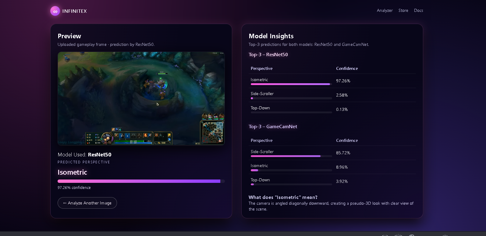
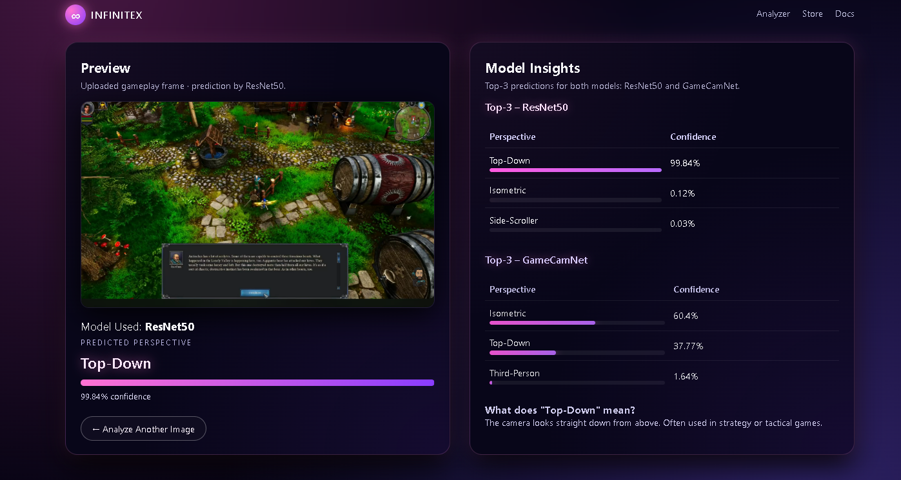
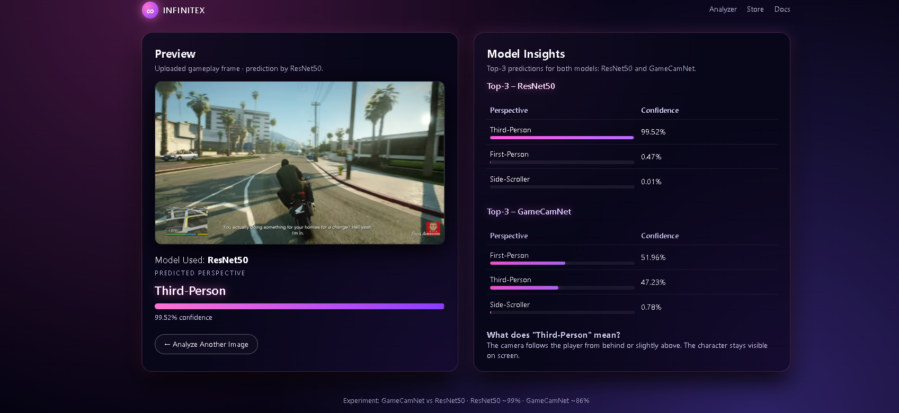
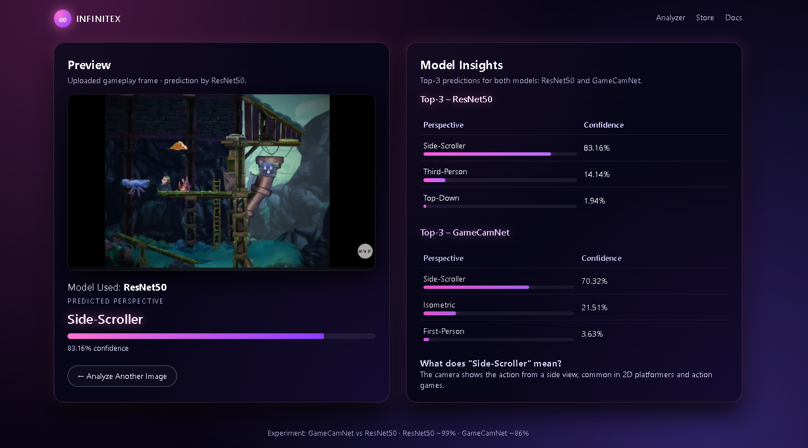
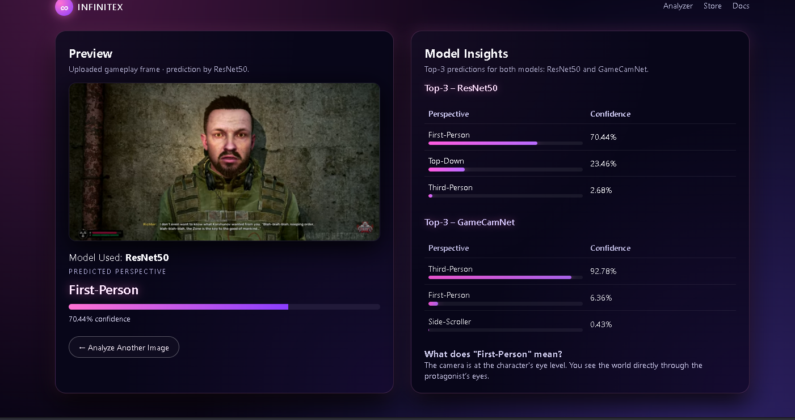
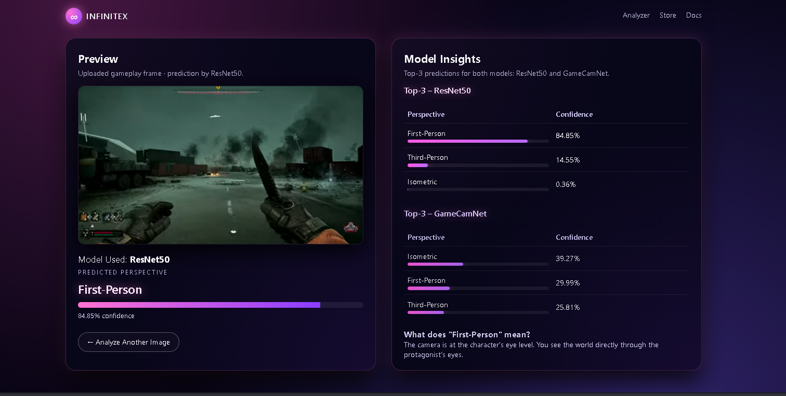

# 🎮 InfiniteX — Kamera Perspektifi Sınıflandırma

> Oyun ekran görüntülerini analiz ederek kameranın **First-Person**, **Third-Person**, **Isometric**, **Top-Down** veya **Side-Scroller** perspektiflerinden hangisine ait olduğunu tahmin eden yapay zeka projesi.


## İçerik Videsu

[▶️ Videoyu İzle](https://github.com/user-attachments/assets/a95baa0f-e06e-4cf8-a5df-597fba7686be)
---
---

## 🚀 Özellikler

- 🔍 Görsel sınıflandırma: 5 kamera perspektifi  
- ⚙️ İki model karşılaştırması: `ResNet50` (transfer learning) vs `GameCamNet` (sıfırdan oluşturulmuş CNN)  
- 💻 Web arayüzü: Flask + HTML + CSS (InfiniteX neon teması)  
- 🧠 Model eğitimi: PyTorch  
- 📊 Karşılaştırmalı çıktı: Her iki modelin Top-3 tahmini aynı ekranda görüntülenir  

---

## 📂 Veri Kümesi

Bu projede kullanılan veri kümesi, farklı oyun türlerinden alınan gerçek gameplay videolarından oluşturulmuştur.

- **Perspektif kategorileri:**
  - First-Person
  - Third-Person
  - Isometric
  - Top-Down
  - Side-Scroller
- **Her kategori için:**
  - 5 farklı oyun seçildi.
  - Her oyunun uzun gameplay videolarından başlangıç / orta / son kısımlarından ~3’er dakikalık segmentler alındı.
  - FFmpeg ile bu segmentlerden **saniyede 1 kare** olacak şekilde görüntü çıkarıldı.
- **Toplam veri:**
  - Toplam görüntü: ≈ **15.6K** frame  
  - Kategori başına: ≈ **2.8K – 3.8K** görüntü  
- Veri, eğitim ve doğrulama için **train / val** olarak ayrıldı (örneğin %80 / %20).

Bu veri kümesi, oyunların farklı kamera açılarına göre çeşitlilik sağlaması için özel olarak toplanmıştır.

---

## 🧩 Kullanılan Modeller

### 1️⃣ GameCamNet (Custom CNN)

Sıfırdan tasarlanmış, hafif ve eğitim süresi kısa bir Evrişimsel Sinir Ağı.

- 4 adet **Conv–BatchNorm–ReLU** bloğu  
- Ardından **MaxPool** katmanları  
- Son kısımda:
  - `AdaptiveAvgPool2d`
  - 2 adet **Fully Connected** katman
  - Dropout ile düzenlileştirme  
- Amaç: Basit, hızlı ve baştan sona kendi tasarlanmış bir baseline model elde etmek  
- Validation doğruluğu: **≈ %86**

Bu model, özellikle daha basit sahneleri ayırt etmede başarılı olsa da, benzer perspektiflerde (örn. FPS vs TPS) zaman zaman hataya düşebilmektedir.

## 🧱 GameCamNet Mimarisi

Aşağıda, sıfırdan geliştirilen GameCamNet modelinin katman yapısı gösterilmektedir:

```text
Input (3x224x224)
│
├── Conv2d(3 → 32, kernel_size=3, padding=1)
├── BatchNorm2d(32)
├── ReLU
├── MaxPool2d(2)
│
├── Conv2d(32 → 64, kernel_size=3, padding=1)
├── BatchNorm2d(64)
├── ReLU
├── MaxPool2d(2)
│
├── Conv2d(64 → 128, kernel_size=3, padding=1)
├── BatchNorm2d(128)
├── ReLU
├── MaxPool2d(2)
│
├── Conv2d(128 → 256, kernel_size=3, padding=1)
├── BatchNorm2d(256)
├── ReLU
├── MaxPool2d(2)
│
├── AdaptiveAvgPool2d((1,1))
├── Flatten
├── Linear(256 → 128)
├── ReLU
├── Dropout(0.5)
└── Linear(128 → 5)  →  [First, Third, Iso, Top, Side]

Bu yapı:

Toplam 4 evrişim bloğu içerir.

Parametre sayısı: yaklaşık 1.2 milyon.

Aktivasyon fonksiyonu olarak ReLU, optimizasyon için Adam kullanılmıştır.

Küçük boyutuna rağmen güçlü genelleme yeteneği göstermiştir.
```
---

### 2️⃣ ResNet50 (Transfer Learning)

ImageNet üzerinde önceden eğitilmiş, derin ve güçlü bir model. Bu projede transfer learning yaklaşımıyla ince ayar yapılmıştır.

- Temel mimari: **ResNet50**
- Önceden eğitilmiş katmanlar kullanıldı
- Son tam bağlı katman, **5 sınıfa karşılık gelecek şekilde** yeniden tanımlandı
- Eğitim sadece son katman(lar) üzerinde yoğunlaştırıldı
- Validation doğruluğu: **≈ %99**

Bu model, farklı oyunlardan gelen görüntülerde yüksek genelleme başarısı göstererek kamera perspektiflerini çok büyük oranda doğru tahmin edebilmektedir. 

---

## 📊 Eğitim Sonuçları (Özet)

| Model              | Doğruluk (Val) | Notlar                                   |
|--------------------|----------------|------------------------------------------|
| GameCamNet (CNN)   | ≈ %86          | Hafif, hızlı fakat karmaşık sahnelerde zorlanıyor |
| ResNet50           | ≈ %99          | Güçlü genelleme, üretim için seçilen model        |

---
## Eğitim Metrikleri
| Metrik               | GameCamNet (CNN) | ResNet50 (TL) |
| -------------------- | ---------------- | ------------- |
| Eğitim Epoch Sayısı  | 15               | 10            |
| Eğitim Doğruluğu     | %89.1            | %99.5         |
| Validation Doğruluğu | %86.4            | %98.9         |
| En İyi Epoch         | 12               | 6             |
| Validation Loss      | 0.35             | 0.03          |
| Overfitting Eğilimi  | Orta             | Düşük         |
| Eğitim Süresi        | 25–30 dk         | ~1.5 saat     |

---
## ⚙️ Kurulum

Projeyi yerel ortamınızda çalıştırmak için:

```bash
# Sanal ortam oluştur
python -m venv venv

# Sanal ortamı aktif et
# Windows:
venv\Scripts\activate
# macOS / Linux:
source venv/bin/activate

# Uygulamayı başlat
python app.py
```

```bash
Kullanıcı görüntü yükler →
   Flask dosyayı kaydeder →
      Görüntü ön işleme (resize + normalize) →
         ResNet50 ve CNN ile tahmin →
             Softmax olasılık hesaplama →
                 Top-3 sonuçlar & açıklama →
                     Arayüzde gösterim

```

| Özellik           | GameCamNet (CNN)               | ResNet50             |
| ----------------- | ------------------------------ | -------------------- |
| Doğruluk          | ~%86                           | ~%99                 |
| Eğitim Süresi     | 25 dk                          | 1.5 saat             |
| Boyut             | 11 MB                          | 97 MB                |
| Güçlü Olduğu Alan | Basit sahneler                 | Gerçekçi 3D sahneler |
| Zayıf Nokta       | Benzer perspektiflerde karışma | Büyük model boyutu   |


| Perspektif           | Görsel                                                     | ResNet50 Doğruluğu |
| -------------------- | ---------------------------------------------------------- | ------------------ |
| **Isometric**        |           | %97.2              |
| **Top-Down**         |             | %99.8              |
| **Third-Person**     |            | %99.5              |
| **Side-Scroller**    |      | %83.1              |
| **First-Person (1)** |     | %70.4              |
| **First-Person (2)** |  | %84.8              |
---
### 📊 GameCamNet (Custom CNN) – Değerlendirme

Validation seti üzerinde GameCamNet için elde edilen metrikler:

- Accuracy: **%86.38**
- Macro F1: **%84.77**
- Macro Precision: **%86.13**
- Macro Recall: **%85.41**
- Toplam örnek: **1483**

Sınıf bazlı F1 skorları:

| Perspektif     | F1 Skoru |
|----------------|---------|
| First-Person   | **0.80** |
| Isometric      | **0.91** |
| Side-Scroller  | **0.78** |
| Third-Person   | **0.76** |
| Top-Down       | **0.99** |

Model özellikle **Top-Down** ve **Isometric** sahnelerde çok yüksek performans gösterirken,  
**First-Person** ve **Third-Person** sınıflarında zaman zaman karışmalar gözlenmiştir.  
Bu yüzden GameCamNet, hafif ve hızlı bir baseline olsa da, daha hassas ayrımlar için ResNet50 kadar güçlü değildir.
---

```bash
InfiniteX/
│
├── app.py                # Flask sunucusu
├── models/
│   ├── resnet_model.pth
│   └── cnn_model.pth
├── static/
│   ├── style.css
│   └── uploads/          # Yüklenen görseller
├── templates/
│   ├── index.html
│   ├── result.html
│   └── docs.html
└── README.md
```

👩‍💻 Geliştirici Notu

Bu proje, oyun içi kamera türlerini makine öğrenmesiyle otomatik olarak ayırt etmeyi amaçlayan bir staj projesidir.
Model, hem düşük donanımda çalışabilmesi hem de yüksek doğrulukla sonuç üretebilmesi için optimize edilmiştir.


---

